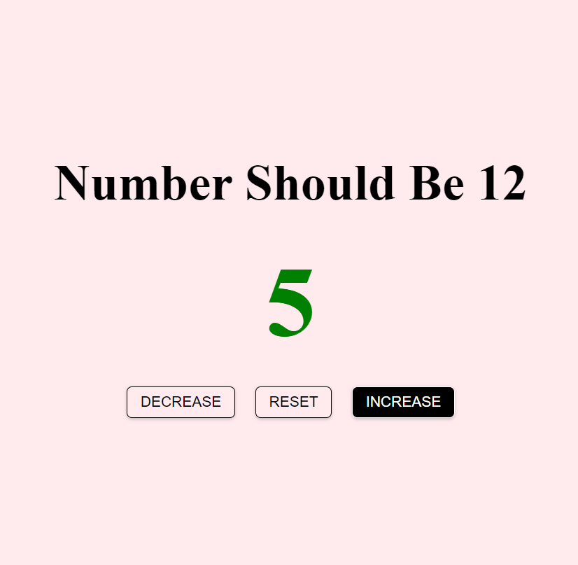

# Number Should be 12

[Click to see](https://ayerdelen.github.io/Counter/)

- This is a tutorial of [Free Code Camp](https://www.youtube.com/watch?v=3PHXvlpOkf4&list=WL&index=21&t=21s)

In the begining it was just decreasing, increasing and resetting the numner. But then I wanted to add some features and gamify this app. In this game number should be 12.

## I've learned:
- Bringing all buttons and selecting them with **contains()** parameter.

- Styling with JS

## I've added:
- When number reached positive 12, it skipped it with return.
- alert(), when condition is fullfilled.

